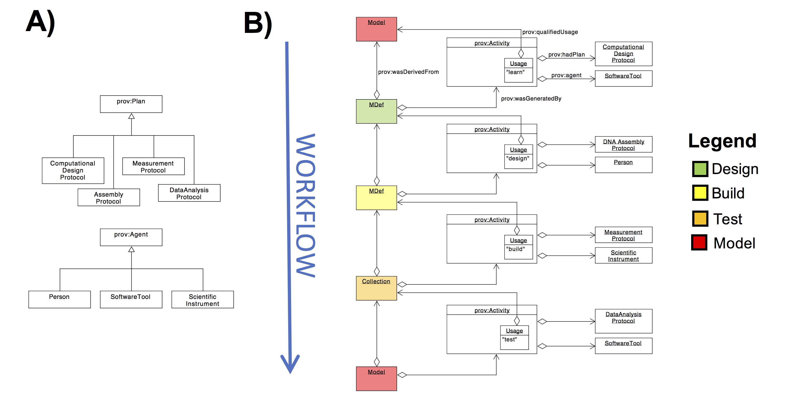
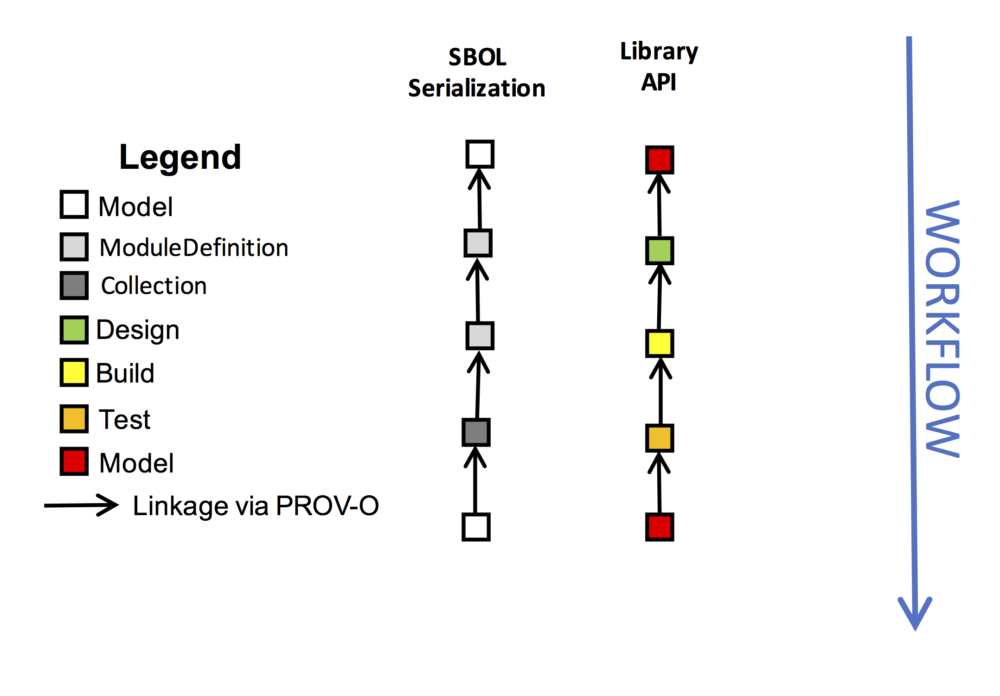

SEP 17 -- Modeling the Design-Build-Test-Learn Cycle with PROV-O Annotations
===================================

SEP                     | <leave empty>
----------------------|--------------
**Title**                | Modeling the Design-Build-Test-Learn Cycle with PROVO Annotations
**Authors**           | Bryan Bartley (bartleyba@sbolstandard.org) and SBOL Developers (authors, please opt in)
**Editor**            | <leave empty>
**Type**              | Data Model
**SBOL Version**      | 2.2
**Status**            | Draft
**Created**           | 05-Sep-2017
**Last modified**     | 05-Sep-2017

Motivation
----------

* Decouples the design-build-test-learn process, according to the foundational principles for engineering biology.
* Provide clear guidance for using PROV-O with illustrative examples. 
* Specifies where to add experimental data
* Provide an SBOL representation of biological instances of a design that can link to LIMS systems
* Capture workflow provenance, a description of the events of a workflow, which is crucial for scientific reproducibility
* Specify data structures which can be used to forward-engineer automated workflows.
* Supports model-based design.
* Supports an easy and intutive API for SBOL libraries.
* Represents workflows as a directed acyclic graph and enables tools to track workflow branches

Specification
-------------

This specification simply introduces 4 new ontology terms to the SBOL data model:
```
sbol:design
sbol:build
sbol:test
sbol:learn
```
These ontology terms will be used to annotate provenance linkages described with PROVO classes previously adopted into SBOL. Throughout this SEP we talk in terms of `design`, `build`, `test`, and `learn` Activities. More specifically, though, these terms are specified in the `hadRole` field of `Usage`, a child class of `Activity`. These annotations are used to enforce a minimal set of simple validation rules. Other than these new ontology terms and validation rules, adoption of this SEP implements no other change to the SBOL specification or serialization.  At the same time, it coherently specifies a several kinds of provenance histories which are important for synthetic biologists (for example which physical samples were used in a DNA assembly), and helps software developers interpret PROVO graphs which can otherwise be confusing and complicated. This helps us achieve the goals set out in Motivation.

For clarity of communication, we also use the terms Design, Build, Test, and Model throughout this SEP to refer to data objects which are produced through design, build, test, and learn Activities. No new SBOL classes are actually specified for serialization. The Design, Build, and Test concepts are modeled in SBOL serialization implicitly through PROVO linkages. However, at a high level, it is still expedient to talk about these objects in terms of Design, Build, and Test. The semantics of these objects are defined below:

* A Design object is generated by an Activity annotated with the label "sbol:design".  A Design object is a conceptual representation of an engineer's imagined and intended design. A Design object is serialized as a ModuleDefinition linked to a "design" Activity.
* A Build object is generated by an Activity annotated with the label "sbol:build". A Build object represents a physical instantiation of a design in the laboratory and serves as an SBOL object that would link to LIMS systems. A Build object is serialized as a ModuleDefinition linked to an Activity annotated with the label "sbol:build". 
* A Test object is generated from an Activity annotated with the label "sbol:test". A Test object serves as a container for experimental data. In simplest terms, a Test might be a container of file URIs corresponding to data files from an experiment. However, a Test might also serve as a Collection of Attachments (see Relationship to Other Proposals). A Test object is serialized as a Collection linked to an Activity annotated with "sbol:test"

The semantics and validation rules associated with these objects are as follows:

**Design**
* A "design" activity generates a new Design object.
* A "design" activity may use a Model as an input. 
* A "design" activity possibly uses other Designs as inputs.
* A "design" activity may not use any other types of objects as inputs.

**Build**
* A "build" activity generates a new Build object
* A "build" activity may use a Design as an input
* A "build" activity possibly uses other Builds as inputs.
* A "build" activity may not use any other types of objects as inputs.

**Test**
* A "test" activity generates a new Test object
* A "test" activity may use a Build as an input
* A "test" activity possibly uses other Tests as inputs.
* A "test" activity may not use any other types of objects as inputs.

**Model**
* A "learn" activity generates a new Model object.
* A "learn" activity may use a Test as an input.
* A "learn" activity possibly uses other Models as inputs.
* A "learn" activity may not use any other types of objects as inputs.

This specification does not prohibit other SBOL developers from developing other kinds of provenance histories. Other uses of PROVO are neither specified nor prohibited.

Relationship to Other Proposals
-------------------------------
This proposal evolved from SEP 14 after much discussion at workshops, on the dev list, and on the Github issue tracker.  This proposal is compatible with others currently under discussion.

* `Protocol` - This proposal is compatible with Protocol, assuming that Protocol is derived from prov:Plan
* `Attachment` - A container class for data files with metadata. This spec could be compatible with Attachment, as the Test object MAY contain a list of Attachment IDs.

This proposal may conflict with another pending proposal, and may require further input from the community:

* `Implementation` - Beal, Grunberg, et al propose creating an explicit Implementation class to represent physical instantiations. Some concerns the authors raise with our current proposal is that provenance tracking requires copying too many objects and may become or difficult to maintain coherently on distributed systems. Another concern is that provenance semantics are not the same as versioning semantics.

Example 1
---------


Example 2
---------

