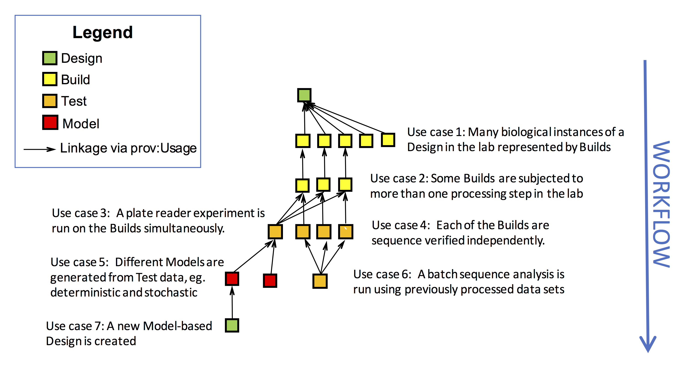
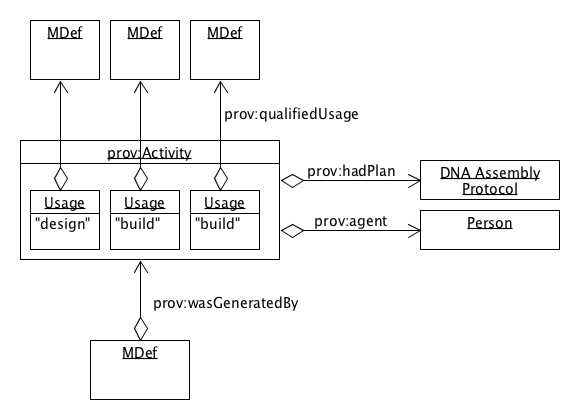

SEP 17 -- Modeling the Design-Build-Test-Learn Cycle with PROV-O Annotations
===================================

SEP                      | <leave empty>
----------------------|--------------
**Title**                | Modeling the Design-Build-Test-Learn Cycle with PROVO Annotations
**Authors**           | Bryan Bartley (bartleyba@sbolstandard.org), Chris Myers (myers@ece.utah.edu), Goksel Misirli (gokselmisirli@gmail.com) and SBOL Developers (authors, please opt in)
**Editor**            | <leave empty>
**Type**              | Data Model
**SBOL Version**      | 2.2
**Status**            | Draft
**Created**           | 05-Sep-2017
**Last modified**     | 05-Sep-2017

Table of Contents  
---------------------

* [Motivation](#motivation)
* [Specification](#specification)
* [Discussion](#discussion)
* [Example](#example)
* [Relation to Other SEPs](#relation)
* [Backwards Compatibility](#compatibility)
* [References](#references)
* [Copyright](#copyright)

Motivation <a name="motivation"></a>
----------
* Decouples the design-build-test-learn process, according to the foundational principles for engineering biology.
* Provide clear guidance for using PROV-O with illustrative examples. 
* Specifies where to add experimental data
* Provide an SBOL representation of biological instances of a design that can link to LIMS systems
* Capture workflow provenance, a description of the events of a workflow, which is crucial for scientific reproducibility
* Specify data structures which can be used to forward-engineer automated workflows.
* Supports model-based design.
* Supports an easy and intutive API for SBOL libraries.
* Represents workflows as a directed acyclic graph and enables tools to track workflow branches

Specification <a name="specification"></a>
-------------

This specification simply introduces 4 new ontology terms to the SBOL data model:
```
sbol:design
sbol:build
sbol:test
sbol:learn
```
These ontology terms define roles for the PROV-O `Usage` class.  Throughout this SEP, we often speak of an SBOL object that "uses" another object for the role indicated by the ontology term.  This plain English description means that two objects are linked through a PROV-O data structure as shown in Example 1. More specifically, these terms are specified in the `hadRole` field of `Usage`, a child class of `Activity`. The parent `Activity` object also contains a link to `Plan` which documents a protocol (such as a laboratory procedure). Thus, PROV-O data structures annotate a reproducible scientific workflow. 

The ontology terms are defined here to describe how an SBOL Object may be used to "generate" another SBOL Object. By the W3 PROV-O specification, generation is defined as:

```
...the completion of production of a new entity by an activity. This entity did not exist before generation and becomes available for usage after this generation.
```

The PROV-O specification is very general and abstract. The spec permits that any kind of SBOL object may be used to "generate" another, even if the meaning of this relationship is not explained anywhere. For example, a Collection might be used to generate a Model. Or, a MapsTo might be used to generate a SequenceAnnotation. Without a standard ontology to describe different provenance connections, it will be near impossible for application developers to interpret provenance relationships or specify workflows in a standardized and reproducible manner.

The provenance semantics described in this SEP are distinctly different from versioning semantics. The SBOL specification specifies that a new version of an SBOL object is created every time a user wants to change the properties of a published object. New versions are made by copying the object and incorporating the change. In contrast, an SBOL object which is "generated" from another is regarded as a new entity, not a new version. Both versioning and provenance semantics can and should be supported by SBOL.

The Usage ontology terms can be thought of as verbs that describe how an object participates in an Activity. In natural language they are defined here as:

* A "design" Usage indicates that the SBOL object is a conceptual representation of an engineer's imagined and intended design
* A "build" Usage indicates that the SBOL object represents a real, physical instantiation of a ModuleDefinition associated with a sample in the lab
* A "test" Usage refers to raw data or experimental observations
* A "learn" Usage refers to a theoretical model, analysis, datasheet which describes the observed behavior of a "build" or predicts the behavior of a "design"

The following validation rules define which types of SBOL objects can used in the above roles, and which types of SBOL object may be generated. In the simplest example, a design-build-test-learn workflow starts with a ModuleDefinition (design) and subsequently generates a new ModuleDefinition (build), a Collection of data attachments (test), and finally a Model (learn).
 
* A ModuleDefinition MAY BE used as a "design". The Activity which uses the design MUST generate a new ModuleDefinition.
* A ModuleDefinition MAY BE used as a "build."  The Activity which uses the build MAY generate a new ModuleDefinition (resulting in a new "build") in the case of a DNA assembly activity. Alternatively, the Activity may generate a Collection of experimental data (a "test"). In this latter case, the "build" indicates the physical sample on which experimental measurements were performed. The Collection which uses the "build" MUST contain references to data files, or Attachment objects, if the Attachment proposal is accepted (see Relation to Other Proposals). The Collection SHOULD BE associated with the measurement protocol that acquired the data, represented by a Plan.  
* A Collection of data MAY BE used as a "test". The corresponding Activity MAY generate a Model or else generate a new Collection of data. An associated Plan should document the data analysis and model-fitting procedure.
* A ModuleDefinition MAY use a Model to "learn". This SHOULD BE used in the case of model-based design. An associated Plan SHOULD document the computational protocol OR an associated Agent indicating the software tool used.

These ontology terms and validation rules define a workflow abstraction.  This abstraction is our particular interpretation of how a design-build-test-learn process should be modeled with SBOL objects. We recognize that other developers may wish to define other workflow abstractions. This specification does not prohibit other SBOL developers from developing other kinds of provenance histories. Other workflow abstractions may be defined by extending the definition of the `design`, `build`, `test`, `learn` ontology terms or introducing new workflow vocabulary.  

Other than these new ontology terms and validation rules, adoption of this SEP implements no other change to the SBOL specification or serialization.  At the same time, it coherently specifies several kinds of provenance histories which are important for synthetic biologists (for example which physical samples were used in a DNA assembly), and helps software developers interpret PROVO graphs which can otherwise be confusing and complicated. This helps us achieve the goals set out in Motivation.

Relation to Other SEPs <a name="relation"></a>
-------------------------------
This proposal evolved from SEP 14 after much discussion at workshops, on the dev list, and on the Github issue tracker.  In order to simplify discussion of the issues in SEP14, we decided to break the issues down into three SEPs separately: SEP 16 introduces an Implementation class, SEP 17 provides guidance on documenting workflows, and SEP 18 introduces the Attachment class to link external data files. Therefor this proposal is compatible with others currently under discussion.

* `Protocol` - This proposal is compatible with Protocol, assuming that Protocol is derived from prov:Plan
* `Attachment` - A container class for data files with metadata. This spec could be compatible with Attachment, as the Test object MAY contain a list of Attachment IDs.

This proposal may conflict with another pending proposal, and may require further input from the community:

* `Implementation` - Beal, Grunberg, et al propose creating an explicit Implementation class to represent physical instantiations. Some concerns the authors raise with our current proposal is that provenance tracking requires copying too many objects and may become or difficult to maintain coherently on distributed systems. Another concern is that provenance semantics are not the same as versioning semantics.

Discussion <a name="discussion"></a>
-------------------------------

The design-build-test-learn cycle is a common theme in synthetic biology and engineering literature. The  cycle is a generalized abstraction of an ideal engineering workflow and approach to problem-solving.  Thefefore, the design-build-test-learn cycle is a de facto ontology upon which to base an SBOL data model for workflow abstraction. Other workflow activities in synthetic biology, such as analyzing, modeling, verifying, and evolving, by and large fit into the design-build-test-learn abstraction. Nevertheless, SBOL developers may wish to introduce new workflow ontology terms as our field progresses. This specification establishes a basis for what those proposals might look like.

Our specification enables synthetic biologists to capture workflow provenance with SBOL. The aim is to
capture a complete description of evaluation and enactment of computational and laboratory protocols in a workflow.  This is crucial to verification, reproducibility, and automation in synthetic biology.
[Example 1](#example) illustrates this workflow provenance. 

In Example 1A, we define some classes for illustrative purposes only. These classes are used for explanatory purposes in Example 1B. The purpose of these classes is to demonstrate how PROV-O classes `Plan` and `Agent` may be extended to describe some of the important players in an `Activity`.  For example, a ComputationalDesignProtocol may document that a Python script was (or will be) executed in order to optimize a DNA sequence for synthesis. An AssemblyProtocol may describe a laboratory protocol (for example, either manual or automated). A SoftwareTool or Person are `Agents` that assist in an `Activity`. These examples illustrate where a developer might want to hook in their own application-specific data model. The PySBOL and libSBOL libraries allow users to define their own extension classes to Plan and Agent through inheritance relationships.

Example 1B uses these descriptive classes to show how Activities are linked together in a design-build-test-learn workflow (we exclude prov:Associations from the UML for brevity). This particular workflow illustrates an idealized workflow for model-based design. The workflow begins with a Model which is used to generate a ModuleDefinition using a computational tool such as iBioSim. A ModuleDefinition is used to generate a new ModuleDefinition via an AssemblyProtocol. The latter represents a build, a physical instantiation linked to a sample in the lab. An automated MeasurementProtocol may be run on laboratory equipment, thus generating a Collection of data files or Attachments. Finally, a new Model might be derived from these data. This Model may not match the beginning Model, as our observation may not match the prediction.

The specification does not introduce any new SBOL classes and is intended to be a parsimonious addition to the data model and have minimal impact on SBOL serialization. The concepts "design", "build", "test", "learn" are therefore implied indirectly through an object's Usage.  Some SBOL Developers favor a more explicit representation. [Example 2](#example2) shows how an explicit representation would look. This explicit model can be implemented in the library API by interpreting PROV-O Usages implicitly. A third option is to introduce new, explicit classes into the SBOL serialization, as Beal and Grunberg propose. We favor adoption of this explicit approach, so long as it has consistent and coherent provenance relationships clearly specified.

[Example 3](#example3) illustrate the various use cases that are possible with this workflow representation. [Example 4](#example4) illustrates an example of "assembly provenance".  This allows the user to track all of the physical instances of components which may be used in a DNA assembly procedure as well as the original design used to generate the new build.

Example 1 <a name="example"></a>
---------


Example 2 <a name="example2"></a>
---------


Example 3 <a name="example3"></a>
---------


Example 4 <a name="example4"></a>
---------



Compatibility <a name="compatibility"></a>
-------------
This proposal does not affect backwards compatibility

References <a name="references"></a> 
----------

Copyright <a name='copyright'></a>
-------------
<p xmlns:dct="http://purl.org/dc/terms/" xmlns:vcard="http://www.w3.org/2001/vcard-rdf/3.0#">
  <a rel="license"
     href="http://creativecommons.org/publicdomain/zero/1.0/">
    
  </a>
  <br />
  To the extent possible under law,
  <a rel="dct:publisher"
     href="sbolstandard.org">
    <span property="dct:title">SBOL developers</span></a>
  has waived all copyright and related or neighboring rights to
  <span property="dct:title">SEP 013</span>.
This work is published from:
<span property="vcard:Country" datatype="dct:ISO3166"
      content="US" about="sbolstandard.org">
  United States</span>.
</p>