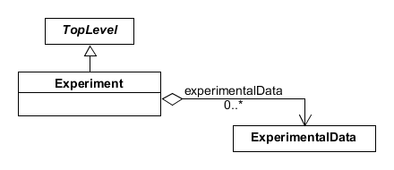
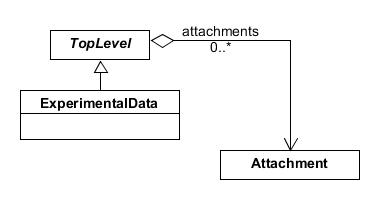
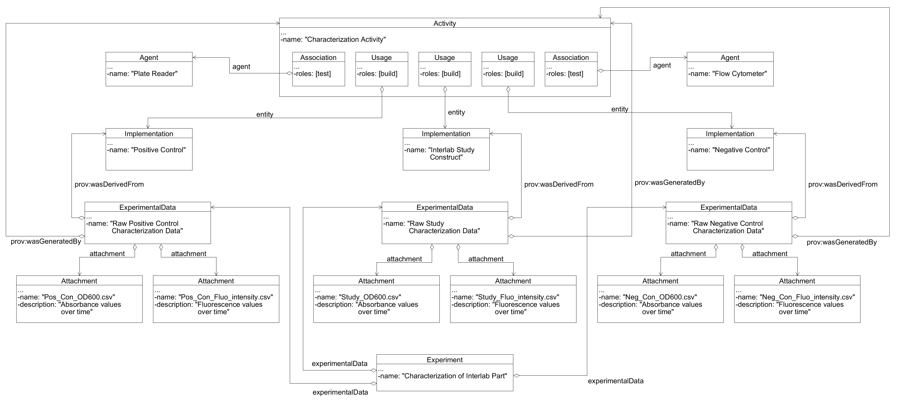

SEP 021 -- Experiments and Experimental Data
======================================================

SEP                   | <leave empty>
----------------------|--------------
**Title**             | SEP 021 -- Experiments and Experimental Data
**Authors**           | Nicholas Roehner (nicholasroehner@gmail.com), Jake Beal (jakebeal@gmail.com)
**Editor**            | Nicholas Roehner (nicholasroehner@gmail.com)
**Type**              | Data Model
**SBOL Version**      | 2.3
**Replaces**          | N/A
**Status**            | Draft
**Created**           | 21-Feb-2018
**Last modified**     | 21-Feb-2018
**Issue**          | [#50](https://github.com/SynBioDex/SEPs/issues/50)

Abstract
-----------

Linking experimental data to samples and genetic designs is becoming critical to many synthetic biology projects, including the DARPA program Synergistic Discovery and Design (SD2).

Table of Contents
---------------------

* [1. Rationale](#rationale)
* [2. Specification](#specification)
  * [2.1 Experiment](#exp)
    * [2.1.1 experimentalData](#exp_expData)
  * [2.2 ExperimentalData](#expData)
  * [2.4 Validation Rules](#validation_rules)
* [3. Examples](#examples)
  * [3.1 Flow Cytometry](#example1)
  * [3.2 Interlab](#example2)
* [4. Backwards Compatibility](#compatibility)
* [5. Discussion](#discussion)
* [6. Relation to Other SEPs](#competing_seps)
* [References](#references)
* [Copyright](#copyright)

Rationale 
----------------

* Grouping `Attachment` objects with classes that are more domain specific than `Collection` will enhance queries for experimental results.
* We will eventually need a class like `ExperimentalData` that can be extended to specify where to index into experimental data files.
* We will eventually need a class like `Experiment` that can be extended to specify or link to an experimental design (number of factors, levels, etc.).

Specification 
----------------------------------------------

Here we propose to add two new classes, `Experiment` and `ExperimentalData`, to enable users to aggregate `Attachment` objects (used to link experimental data files) in a more domain-specific manner than just using the SBOL `Collection` class.

We also propose to modify the best-practice validation rules that govern the specification of provenance relationships between objects in a design-build-test-learn cycle.

### 2.1 Experiment 

The `Experiment` class represents the aggregation of experimental results in accordance with some experimental design (currently not specified by this class).

**Figure 1:** Diagram of the `Experiment` class and its associated properties

#### 2.1.1 Experiment.experimentalData 

The `experimentalData` property is OPTIONAL and MAY contain zero or more URIs that refer to `ExperimentalData` objects.

### 2.2 ExperimentalData 

The `ExperimentalData` class represents an aggregation of experimental data files that are typically (but not always) associated with a single sample.

**Figure 2:** Diagram of the `ExperimentalData` class and its associated properties

### 2.3 Modified Validation Rules for Design-Build-Test-Learn Cycles 

* sbol-12506 should be changed from

"A `Usage` that has a `roles` property that contains the URI http://sbols.org/v2#test SHOULD refer to an `Attachment` or `Collection` of `Attachment` objects."

to

"A `Usage` that has a `roles` property that contains the URI http://sbols.org/v2#test SHOULD refer to an `ExperimentalData` object."

* sbol-10226 should be changed from

"A `Identified` with a `wasGeneratedBys` property that includes a reference to an `Activity` with a child `Association` that has a `roles` property that contains the URI http://sbols.org/v2#test SHOULD be an `Attachment` or a `Collection` of `Attachment` objects."

to

"A `Identified` with a `wasGeneratedBys` property that includes a reference to an `Activity` with a child `Association` that has a `roles` property that contains the URI http://sbols.org/v2#test SHOULD be an `ExperimentalData` object."

Examples 
-------------------------------

### 3.1 Flow Cytometry 

**Figure 3:** An example of using the classes from this

### 3.2 Interlab Example 

**Example 2:** A simple representation of an Experiment that characterizes an Interlab part with two controls. The Experiment is derived from three Implementations: a positive control, a negative control, and the study construct. The Experiment itself was generated by an activity. The Experiment has ExperimentalData, which is raw characterization data, and is linked back to the three Implementations using wasGeneratedBy. Finally, two CSV files are attached to ExperimentalData: one for the absorbance values, and one for the fluorescence values.

Backwards Compatibility 
-----------------

This proposal does not affect backwards compatibility.

Discussion 
-----------------

Relation to Other SEPs 
-----------------

This proposal revises the best-practice validation rules from SEP 019 that were recently incorporated into SBOL version 2.2.

References 
----------------

Copyright 
-------------

  
   
  To the extent possible under law,
  <a rel="dct:publisher"
     href="sbolstandard.org">
    SBOL developers</a>
  has waived all copyright and related or neighboring rights to
  SEP 007.
This work is published from:

  United States.

