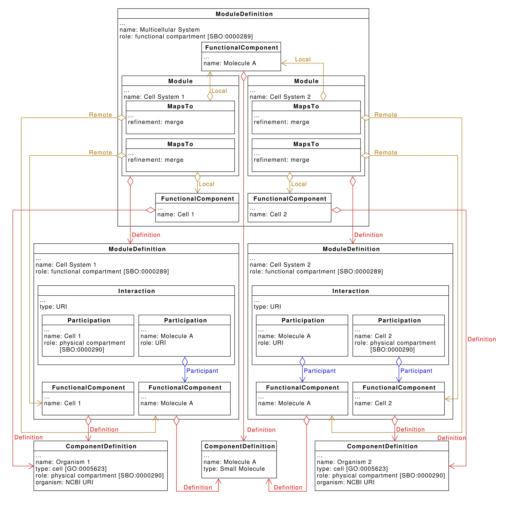

SEP 030 -- Best Practices for Multicellular System Designs
===================================

SEP                   | 030
----------------------|--------------
**Title**             | Best Practices for Multicellular System Designs
**Authors**           | Bradley Brown, Christian Atallah, James Alastair McLaughlin, Göksel Misirli, Ángel Goñi-Moreno, Nicholas Roehner, David James Skelton, Bryan Bartley, Jacob Beal, Chueh Loo Poh, Irina Dana Ofiteru, and Anil Wipat
**Editor**            |
**Type**              | Data Model
**SBOL Version**      | 2.3
**Replaces**          |
**Status**            | Draft
**Created**           | 06-Nov-2018
**Last modified**     | 06-Nov-2018

Abstract
-----------

This SEP proposes some potential best practices for capturing information about multicellular designs.

## 1. Motivation
--------------

SBOL has been used extensively to represent designs in homogeneous systems, where the same design is implemented in every cell. However, in recent years there has been increasing interest in multicellular systems, where biological designs are split across multiple cells to optimise the system behaviour and function. Therefore, there is a need to define a set of best practices so that multicellular systems can be captured using SBOL in a standard way.

## 2. Specification
----------------------------------------------

### 2.1 Representing Cells

The examples in A) and B) represent a cell which contains molecules 'A' and 'B', which interact in some way. **A)** First proposal for capturing cell designs in SBOL. A `ModuleDefinition` is used to represent the entire cell. This `ModuleDefinition` has a role of 'physical compartment' from the Systems Biology Ontology (SBO) and is annotated with a URI pointing to an entry in the NCBI Taxonomy Database. Interactions occurring within the cell are specified using `Interaction` classes. **B)** Second approach for capturing cell designs in SBOL. A `ComponentDefinition` annotated with a URI pointing to an entry in the NCBI Taxonomy Database is used to capture information about the cell's strain/species. The `ComponentDefinition` instance has a type of 'Cell' from the Gene Ontology (GO), and a role of 'physical compartment'. An instance of the `ModuleDefinition` class is used to represent a system in which the cell is implemented. Entities, including the cell, are instantiated as `FunctionalComponents`, and process are captured using the `Interaction` class. Process which are contained within the cell are represented by including the cell as a participant with a role of 'physical compartment'. **C)** Example of how the `Interaction` class can be used to explicitly confer that an entity is contained inside a cell. Here a plasmid is specified as being contained within a cell.

### 2.2 Multiple Cells in a Single Design

#### 2.2.1 Approach 1

Captured here is a design involving two cells which both interact with the small molecule 'Molecule A'. Designs for Cell 1 and Cell 2 are captured using the approach depicted in Figure 1A, however this proposed approach is also compatible with the method shown in Figure 1B. The overall multicellular system is represented by a `ModuleDefinition` with a role of 'functional compartment', which is an SBO term. Both Cell 1 and Cell 2 are included in this design as an instance of the `Module` class. Interactions between the cells can be elucidated by comparing the entities which participate in processes defined within the cell designs. Cell 1 and Cell 2 in this design both have process which involve 'Molecule A', and hence can be deduced to have some form of intercellular interactions.

#### 2.2.2 Approach 2

Captured here is a design involving two cells which both interact with the small molecule 'Molecule A'. Designs for Cell 1 and Cell 2 are captured using the approach depicted in Figure 1B, as this proposed approach is not compatible with the method shown in Figure 1A. The overall multicellular system is represented by a `ModuleDefinition` with a role of 'functional compartment'. Both Cell 1 and Cell 2 are included in this design as an instance of the `FunctionalComponent` class, which is defined by the `ComponentDefinition` instance which captures taxonomic information about the cell. Intercellular interactions are defined explicitly using the `Interaction` class. In this design, 'Molecule A' participates in processes within both Cell 1 and Cell 2.

#### 2.2.3 Approach 3

Captured here is a design involving two cells which both interact with the small molecule 'Molecule A'. Designs for Cell 1 and Cell are captured using the approach depicted in Figure 1B, as this proposed approach is not compatible with the method shown in Figure 1A. The overall multicellular system is represented by a `ModuleDefinition` with a role of 'functional compartment', which is an SBO term. The two systems involving Cell 1 and Cell 2 are included in this multicellular design as instances of the `Module` class. Entities in the multicellular design, including those in the Cell 1 and Cell 2 system designs, are instantiated as a `FunctionalComponent`. Instances of the `MapsTo` class are used to map entities specified in both the individual cell systems, and the multicellular system.

### 2.3 Cell Ratios

**A-C)** demonstrate which class instances should be annotated with cell proportions for the approaches described in Figures 2-4 respectively. **D)** Alternative to annotating class instances with cellular proportions based on SEP 028. Instances of the `Measure` class are used to capture the percentage of each cell type present in the multicellular system design.

## 3. Backwards Compatibility 
-----------------

The best practices in this proposal do not affect backwards compatibility.

## 4. Discussion 
-----------------

## 5 Related SEPs
----------------

## 6. Competing SEPs 
-----------------

None.

References 
----------------

Copyright 
-------------

  
   
  To the extent possible under law,
  <a rel="dct:publisher"
     href="sbolstandard.org">
    SBOL developers</a>
  has waived all copyright and related or neighboring rights to
  SEP 030.
This work is published from:

  United Kingdom.

